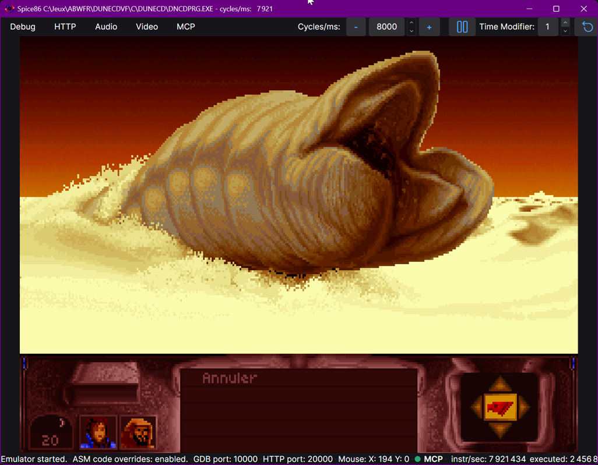
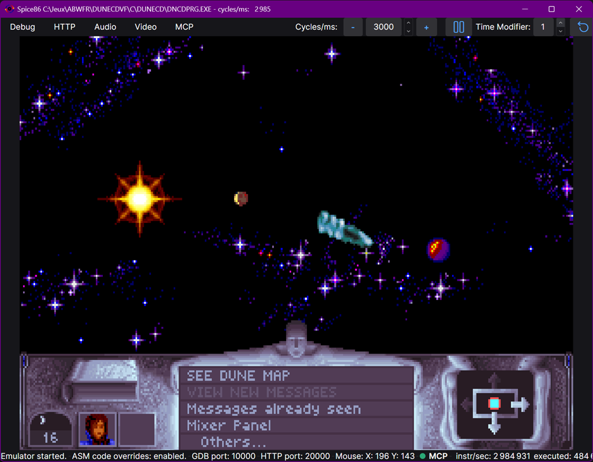

# Cryo dune reverse engineering

Fiddling with [Cryo dune](https://en.wikipedia.org/wiki/Dune_(video_game)) (CD Version) for fun:
 - Trying to understand how the game works with [Spice86 reverse engineering toolkit](https://github.com/OpenRakis/Spice86) which allows to run real mode x86 ASM / C# hybrids.
 - Rewriting the game in C# bit by bit.

SHA256 signature of supported dncdprg.exe: 5f30aeb84d67cf2e053a83c09c2890f010f2e25ee877ebec58ea15c5b30cfff9

The CD release of DUNE (version 3.7, the most widely available one), must be downloaded separately, as it is *copyrighted material*.

This projects requires the [.NET 8](https://dotnet.microsoft.com/en-us/download/dotnet/8.0) SDK.

# Download
See the [releases](https://github.com/OpenRakis/Cryogenic/releases) section.

The CD release of DUNE (version 3.7, the most widely available one), must be downloaded separately, as it is *copyrighted material*.

# Status
Thanks to the hybrid ASM / .NET mode provided by [Spice86](https://github.com/OpenRakis/Spice86), the game is fully playable, including sound and music. 

The goal is to have more and more logic written in human readable C#.

# Running it
To run it, just run the project with dune CD exe in parameter:

```
git clone https://github.com/OpenRakis/Crygenic
cd Cryogenic/src
dotnet run --Exe C:/path/to/dunecd/DNCDPRG.EXE --UseCodeOverride true
```

# Running it with music and sound effetcs enabled:

Example with Adlib music:
```
cd Cryogenic/src
dotnet run --Exe C:/path/to/dunecd/DNCDPRG.EXE --UseCodeOverride true -a "ADL220 SBP2227"
```

# Building it
 - Clone this repo, and build it:

```
git clone https://github.com/OpenRakis/Crygenic
cd Cryogenic/src
dotnet build
```







