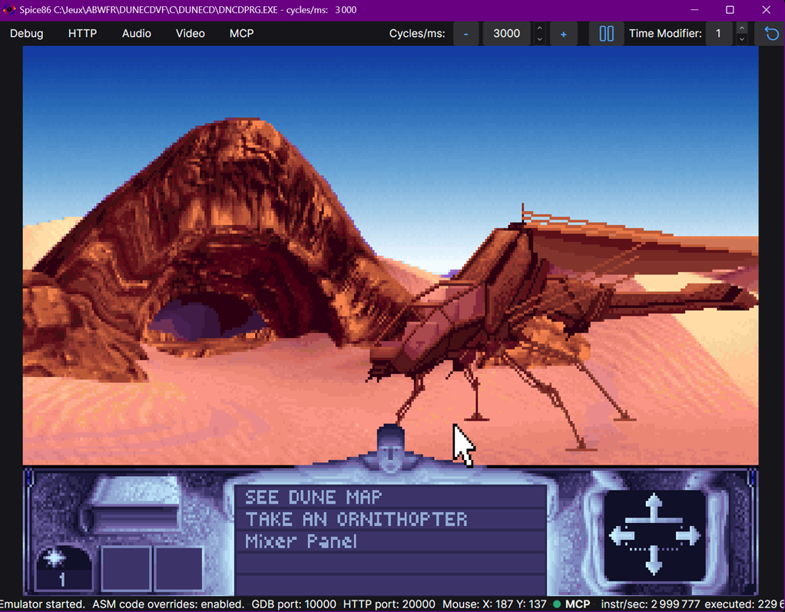
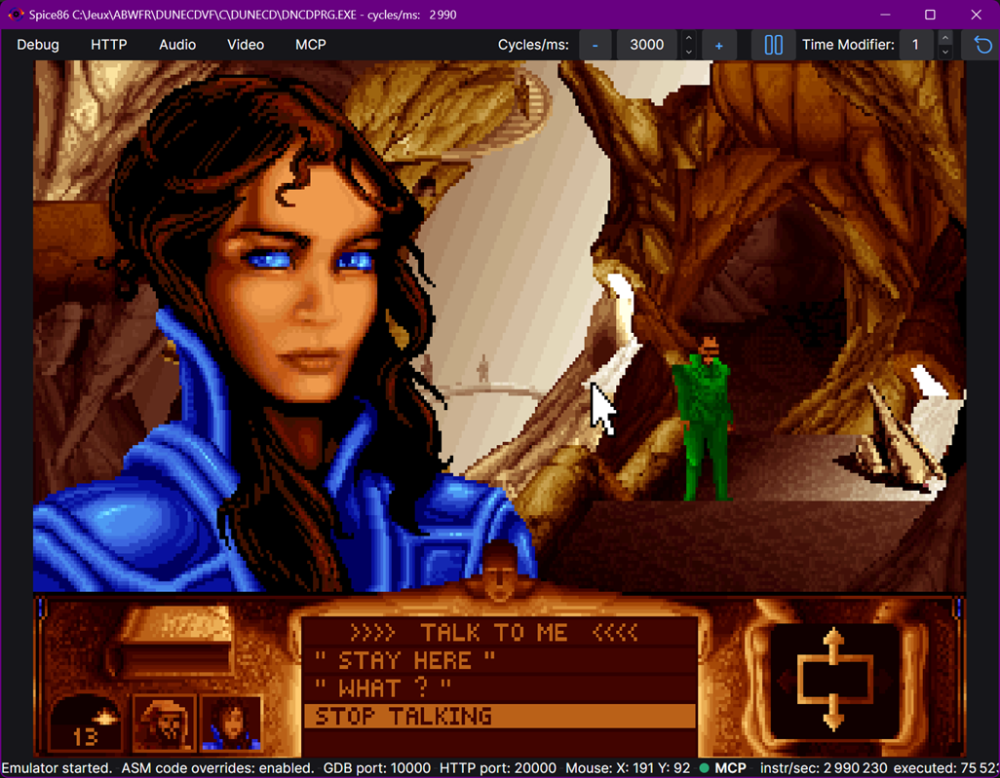
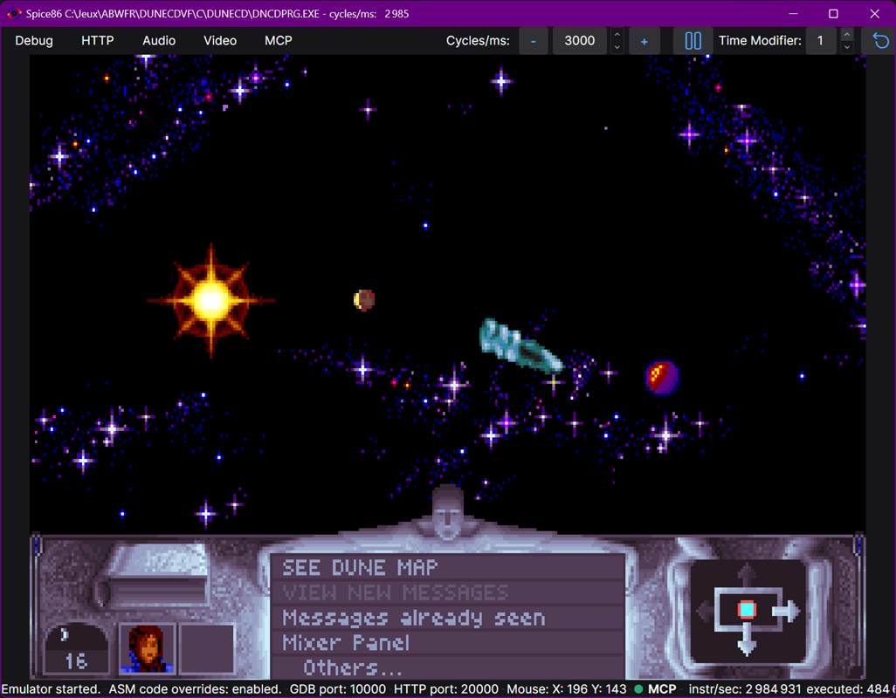
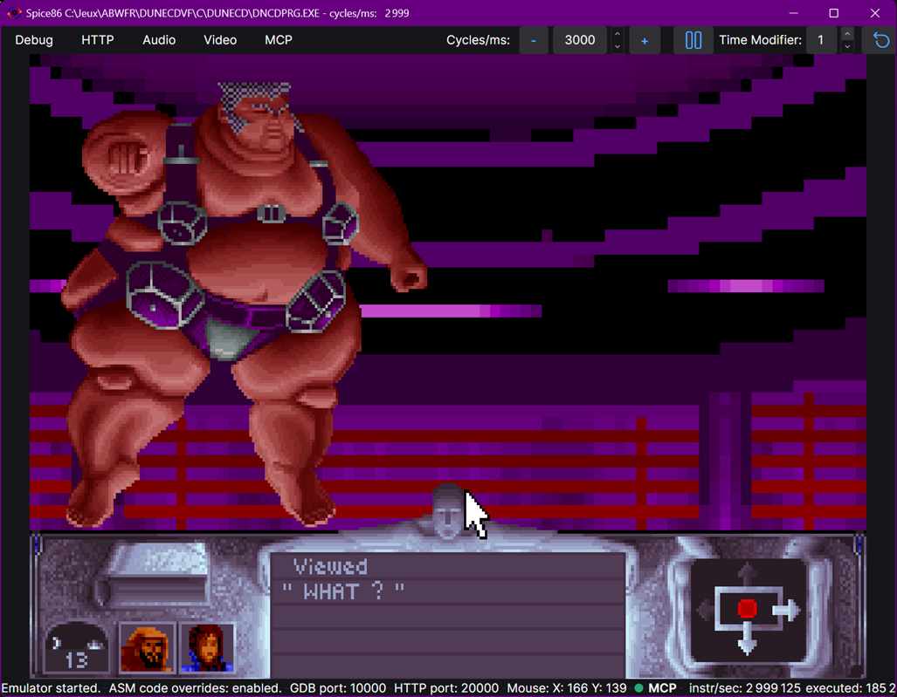
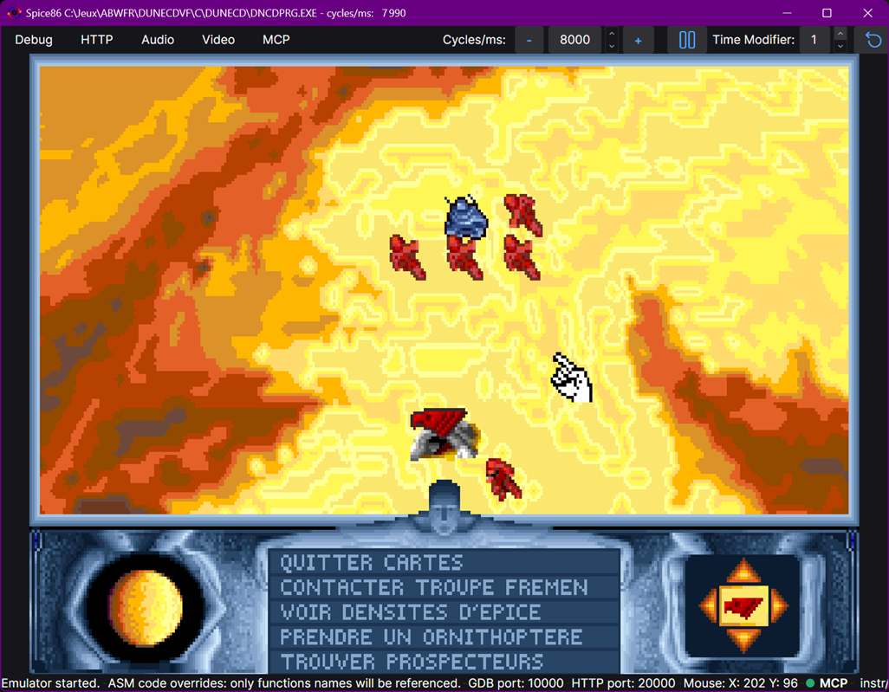

# Cryogenic

[](https://github.com/OpenRakis/Cryogenic/actions/workflows/pr-validation.yml)
[](https://github.com/OpenRakis/Cryogenic/actions/workflows/release.yml)
[](https://github.com/OpenRakis/Cryogenic/actions/workflows/static.yml)
[](https://github.com/OpenRakis/Cryogenic/security/code-scanning)
[](LICENSE)
[](https://github.com/OpenRakis/Cryogenic/releases/latest)
[](https://dotnet.microsoft.com/)

C# re-implementation of Cryo's Dune (CD Version, 1992) running on [Spice86](https://github.com/OpenRakis/Spice86).

**[Project page](https://openrakis.github.io/Cryogenic/)**

---

## Table of Contents

- [What This Is](#what-this-is)
- [Current State](#current-state)
- [How It Works](#how-it-works)
- [Code Structure](#code-structure)
- [Prerequisites](#prerequisites)
- [Build and Run](#build-and-run)
- [Screenshots](#screenshots)
- [Contributing](#contributing)
- [Resources](#resources)
- [License](#license)

---

## What This Is

Cryogenic replaces x86 assembly routines in the DOS executable `DNCDPRG.EXE` with C# methods. [Spice86](https://github.com/OpenRakis/Spice86) runs the original binary and redirects execution to the C# overrides at registered addresses. Assembly and C# code share the same emulated memory, so overrides can be introduced one function at a time without breaking the rest of the program.

### Supported Executable

SHA256 of the required `DNCDPRG.EXE` (Dune CD version 3.7):

```
5f30aeb84d67cf2e053a83c09c2890f010f2e25ee877ebec58ea15c5b30cfff9
```

The game files (`DNCDPRG.EXE`, `DUNE.DAT`) are copyrighted and must be obtained separately.

---

## Current State

The game is fully playable with sound and music through hybrid ASM/.NET execution.

Ongoing work converts additional assembly routines into C#. Each converted routine is registered as an override and tested by running the game.

---

## How It Works

1. `Program.cs` configures command-line arguments and calls `Spice86.Program.RunWithOverrides<DuneCdOverrideSupplier>` with the expected SHA256 checksum.
2. `DuneCdOverrideSupplier` instantiates `Overrides.Overrides`, which calls `DefineOverrides()`.
3. `DefineOverrides()` registers C# methods at specific segment:offset addresses using `DefineFunction` (replaces CALL targets) and `DoOnTopOfInstruction` (inline hooks).
4. At runtime, when the emulated CPU reaches a registered address, Spice86 executes the C# method instead of the original assembly. The method returns via `NearRet()` or `FarRet()` matching the original instruction.
5. Game state is read and written through typed accessor classes (`globalsOnDs`, `globalsOnCsSegment0x2538`) that map directly to the emulated memory at the DS and CS segment bases.

### Memory Segments

The `Overrides` class declares five segment fields used when registering overrides:

| Field | Value | Contents | Overrides registered |
|-------|-------|----------|---------------------|
| `cs1` | `0x1000` | Main game code (`DNCDPRG.EXE` loaded here) | ~80 functions across most override files |
| `cs2` | `0xD000` | DNVGA — VGA graphics driver | 32 functions in `VgaDriverCode.cs`, 1 in `StaticDefinitions.cs` |
| `cs3` | `0xE000` | DNPCS2 / DNSBP — PCM audio driver | None (declared but unused in current overrides) |
| `cs4` | `0xE000` | Reserved for MIDI driver memory-dump hooks | 2 inline hooks for memory dumps at offsets 0x02DC and 0x03EE |
| `cs5` | `0x0800` | Interrupt handlers (custom segment replacing default 0xF000) | None (declared for address reference) |

`cs3` and `cs4` share address `0xE000`. In `DriverLoadToolbox`, PCM drivers (DNPCS2, DNSBP) load at `DRIVER2_SEGMENT = 0xE000`, and music drivers (DNMID) load at `DRIVER3_SEGMENT = 0xF000`. The MT-32 overrides in `MT32DriverCode.cs` use hardcoded `0xF000` (3 functions), not any `cs` field.

### Driver Remapping

`DriverLoadToolbox` temporarily removes the memory allocator's segment limit so drivers load at fixed addresses:

| Driver | Name | Remapped to | Purpose |
|--------|------|-------------|---------|
| DNVGA | VGA graphics | `0xD000` | Display, blitting, palette, mouse cursor |
| DNPCS2 | PC Speaker variant 2 | `0xE000` | PCM sound effects |
| DNSBP | Sound Blaster Pro | `0xE000` | PCM sound effects |
| DNMID | MIDI | `0xF000` | Music playback (MT-32, AdLib) |

Drivers DN386, DNADL, DNADP, DNADG, DNSDB are not remapped. After each driver loads, `ResetAllocator` restores the original allocator state. The remapping hooks are injected at CS1:E57B (`RemapDrivers`) and CS1:E593 (`ResetAllocator`). Driver function tables are auto-detected at CS1:E589 (`ReadDriverFunctionTable`).

---

## Code Structure

```
src/Cryogenic/
├── Program.cs                     Entry point; configures args, launches Spice86
├── DuneCdOverrideSupplier.cs      Implements IOverrideSupplier; creates Overrides instance
├── DriverLoadToolbox.cs           Remaps driver segments to 0xD000/0xE000/0xF000
├── Overrides/
│   ├── Overrides.cs               Defines segment fields (cs1–cs5), registers all overrides
│   ├── VgaDriverCode.cs           23 VGA functions: mode setting, blitting, palette, mouse cursor
│   ├── MenuCode.cs                14 menu-type constants, 2 menu state overrides
│   ├── DialoguesCode.cs           3 dialogue functions: counter, init, hex-digit conversion
│   ├── MapCode.cs                 5 map/cursor functions and click-handler address constants
│   ├── DisplayCode.cs             11 framebuffer and font selection functions
│   ├── VideoCode.cs               3 HNM video playback functions
│   ├── HnmCode.cs                 1 HNM file I/O function (disk read into buffer)
│   ├── TimeCode.cs                2 day/night cycle and hour-of-day functions
│   ├── TimerCode.cs               1 PIT 8254 timer configuration function
│   ├── ScriptedSceneCode.cs       2 cutscene sequence data functions
│   ├── DatastructuresCode.cs      2 memory structure functions (index-to-pointer, sprite lookup)
│   ├── InitCode.cs                1 VGA state initialization function
│   ├── MT32DriverCode.cs          3 Roland MT-32 MIDI driver functions at segment 0xF000
│   ├── UnknownCode.cs             20 partially understood functions (bit ops, memcpy, state flags)
│   └── StaticDefinitions.cs       137+ symbolic names for unoverridden functions (tracing only)
├── Globals/                       Typed accessors added manually (Extra* files)
└── Generated/                     Auto-generated memory accessors (do not edit)
```

### Override Files in Detail

**VgaDriverCode.cs** — Replaces functions in the DNVGA driver loaded at segment 0xD000. Covers VGA mode setting (`VgaFunc00SetMode`), framebuffer blitting (`VgaFunc05Blit`), rectangle copy (`VgaFunc12CopyRectangle`), pixel write (`VgaFunc21SetPixel`), palette loading (`LoadPaletteInVgaDac`), mouse cursor draw/restore (`VgaFunc03DrawMouseCursor`, `VgaFunc04RestoreImageUnderMouseCursor`), buffer fill (`VgaFunc08FillWithZeroFor64000AtES`), texture generation (`VgaFunc36GenerateTextureOutBP`), map block copy (`CopyMapBlock`), and VGA retrace synchronization (`WaitForRetrace`).

**MenuCode.cs** — Defines 14 menu-type constants as hex offsets (e.g. `MENU_TYPE_DIALOGUE = 0x1F7E`, `MENU_TYPE_GLOBE = 0x204A`, `MENU_TYPE_BOOK = 0x2032`). Contains two overrides: one for menu animation state transitions at CS1:D316 and one for setting the current menu type at CS1:D41B.

**DialoguesCode.cs** — Three functions: incrementing a dialogue counter at DS:47A8 (CS1:A1E8), initializing dialogue state including video index and face-zoom timing (CS1:C85B), and converting the low nibble of AL to an ASCII hex digit (CS1:A8B1).

**MapCode.cs** — Defines click-handler addresses for five map modes (flat map, globe, in-game, troop movement, ornithopter). Five functions set the active click handler, initialize map cursor type, and perform an 8-byte memory copy from DS:46E3.

**DisplayCode.cs** — Manages three framebuffers (front at DBD6, back at DC32, text at DBD8). Includes three font-selection functions (intro, menu, book) that set character-set addresses, plus coordinate lookup, buffer clear, and register push/pop helpers.

**VideoCode.cs** — Three functions for HNM video playback: resource flag lookup from a table at DS:33A3, playback index synchronization, and completion check via the finished-flag at DBE7.

**HnmCode.cs** — One function that reads HNM video data from disk through the DOS file manager, updating read offset and buffer pointers.

**TimeCode.cs** — Extracts the current hour from the lower 4 bits of the game elapsed-time word at DS:0002. Calculates the next sunlight-visible day.

**TimerCode.cs** — Writes a 16-bit counter value to PIT channel 0 (ports 0x43/0x40) with control byte 0x36. Called primarily on game exit.

**ScriptedSceneCode.cs** — Reads 16-bit commands from the scene sequence data at DS:4854 and advances the sequence pointer.

**DatastructuresCode.cs** — Converts an index table to a pointer table by adding a base offset. Retrieves sprite-sheet resource pointers by index from the table at DS:DBB0.

**MT32DriverCode.cs** — Three functions at segment 0xF000 for Roland MT-32 output: a primary entry point, a MIDI byte-write to port 0x330, and an unused stub.

**UnknownCode.cs** — 20 functions with observed behavior but unclear purpose. Includes bit-test operations on DBC8, multi-register shifts, 8-byte memory copies, state-flag setters, a 10-byte structure builder, a 0x5C-byte fill at DS:47F8, and three no-ops.

**StaticDefinitions.cs** — Registers 137+ symbolic function names (e.g. `play_intro`, `open_dune_dat`, `allocator_init`) at their addresses for Spice86's trace output. These are not overridden; they provide readable names in execution logs.

---

## Prerequisites

1. [.NET 10 SDK](https://dotnet.microsoft.com/en-us/download/dotnet/10.0)
2. `DNCDPRG.EXE` and `DUNE.DAT` from Dune CD version 3.7 (copyrighted; obtain separately)

Verify the executable checksum:

```bash
# Linux/Mac
sha256sum DNCDPRG.EXE

# PowerShell
Get-FileHash DNCDPRG.EXE -Algorithm SHA256
```

---

## Build and Run

### Build

```bash
git clone https://github.com/OpenRakis/Cryogenic
cd Cryogenic/src
dotnet build
```

### Run (no audio)

Place `DUNE.DAT` and `DNCDPRG.EXE` in the same directory, then:

```bash
cd Cryogenic/src
dotnet run --Exe /path/to/DNCDPRG.EXE --UseCodeOverride true -p 4096
```

`--UseCodeOverride true` is required. Without it, no C# overrides execute.

### Run with audio

AdLib music and Sound Blaster PCM:

```bash
cd Cryogenic/src/Cryogenic
dotnet publish
bin/Release/net10.0/publish/Cryogenic --Exe /path/to/DNCDPRG.EXE --UseCodeOverride true -p 4096 -a "ADL220 SBP2227"
```

---

## Screenshots

<div align="center">


*Orni*


*Chani dialogue*


*Spice shipment screen*


*Harkonnen scene*


*Dune map*

</div>

---

## Contributing

See [CONTRIBUTING.md](CONTRIBUTING.md) for setup instructions, coding conventions, and the override implementation workflow.

Contribution areas:

- **Reverse engineering** — analyze assembly, implement C# overrides, register them in `DefineOverrides()`
- **Documentation** — add XML doc comments, document data structures, explain function behavior
- **Testing** — run the game, compare behavior against the original, report differences
- **Code quality** — refactor existing overrides, improve naming, remove duplication

---

## Resources

- [Project page](https://openrakis.github.io/Cryogenic/)
- [GitHub repository](https://github.com/OpenRakis/Cryogenic)
- [Spice86](https://github.com/OpenRakis/Spice86) — the emulator and reverse-engineering toolkit used by this project
- [Releases](https://github.com/OpenRakis/Cryogenic/releases)
- [Dune (1992) on Wikipedia](https://en.wikipedia.org/wiki/Dune_(video_game))

---

## License

Apache License 2.0. See [LICENSE](LICENSE).

Copyright 2021–2024 Kevin Ferrare and contributors.

Dune is copyright Cryo Interactive Entertainment. This project is not affiliated with or endorsed by Cryo Interactive Entertainment or any rights holders.
